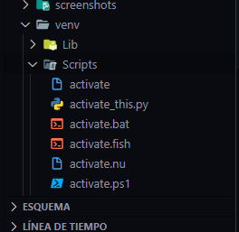
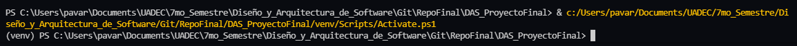

# PROYECTO FINAL

## Para el proyecto (ALPHA) utilizamos:
- [Python 3.10.0](https://www.python.org/downloads/release/python-3100/)
- [React](https://create-react-app.dev/)
- [Flask](https://flask.palletsprojects.com/en/2.0.x/)
- [MongoDB](https://www.mongodb.com/es)
- [MongoDB Compass](https://www.mongodb.com/products/compass)(Para ver resultados de manera comoda `opcional`)
- [Postman](https://www.postman.com/) (Para realizar peticiones a las API `opcional`)
- [NodeJS](https://nodejs.org/es/) **La actual**

## Instrucciones
## Haz esto si ya instalaste todo
- En una consola utiliza el siguiente comando, para instalar los requerimentos para python/flask (Desde la carpeta donde se encuentra `requirements.txt`)
```
pip install -r requirements.txt
```

- Utilizar el siguiente comando cuando hayas hecho lo anterior
```
virtualenv venv
```
- Al momento de nosotros ejecutar el comando nos creara varias carpetas en el directorio



- Es momento de abrir otra consola nos dirigimos a la carpeta .\venv\Scripts mediante cmd (cd .\venv\Scripts), luego de esto introduciremos 
```
.\activate.bat
```
Al momento de nosotros hacer eso a lado izquierdo de la ruta nos debe aparecer (venv) como se ve en la imagen



- Abriremos otra consola
Escribiremos `mongo`

**En dado caso que aparezca que no se reconoce el comando ver el [siguiente video](https://youtu.be/2vjeCOiLc5g)**
