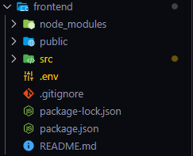

# PROYECTO FINAL

## Para el proyecto (ALPHA) utilizamos:
- [Python 3.10.0](https://www.python.org/downloads/release/python-3100/)
- [React](https://create-react-app.dev/)
- [Flask](https://flask.palletsprojects.com/en/2.0.x/)
- [MongoDB](https://www.mongodb.com/es)
- [MongoDB Compass](https://www.mongodb.com/products/compass)(Para ver resultados de manera comoda `opcional`)
- [Postman](https://www.postman.com/) (Para realizar peticiones a las API `opcional`)
- [NodeJS](https://nodejs.org/es/) **LTS** (Si te instalaste la Actual desinstala esa version e instala la LTS **perdooon la actual da muchos fallos**)

## Instrucciones
## Haz esto si ya instalaste todo
- En una consola utiliza el siguiente comando, para instalar los requerimentos para python/flask (Desde la carpeta donde se encuentra `requirements.txt`)
```
pip install -r requirements.txt
```

- Utilizar el siguiente comando cuando hayas hecho lo anterior
```
virtualenv venv
```
- Al momento de nosotros ejecutar el comando nos creara varias carpetas en el directorio


- Es momento de abrir otra consola nos dirigimos a la carpeta .\venv\Scripts mediante cmd (cd .\venv\Scripts), luego de esto introduciremos 
```
.\activate.bat
```
Al momento de nosotros hacer eso a lado izquierdo de la ruta nos debe aparecer (venv) como se ve en la imagen


- Abriremos otra consola
Escribiremos `mongo`

**En dado caso que aparezca que no se reconoce el comando ver el [siguiente video](https://youtu.be/2vjeCOiLc5g)** (Cerrar consola, abrir una nueva y escribir `mongo`)

En el siguiente paso haremos lo siguiente:


Tomaremos la carpeta `\src` (dentro de la carpeta `\frontend`) y el archivo `.env` (tambien de la carpeta `\frontend`) y los guardaremos en una carpeta aparte (esta carpeta sera temporal)

Luego de esto borramos la carpeta `\frontend`

En una consola nos dirigimos a la carpeta del repositorio (mediante comandos) (`\DAS_ProyectoFinal`) y ponemos el siguiente comando
```
npx create-react-app frontend
```

Aqui nos creara otra vez la carpeta frontend, pero desde cero (esto para tener react activo en nuestras maquinas)

Dentro de esa carpeta nos dejara una carpeta `\src`, la vamos a eliminar

Ahora es cuando los archivos que guardamos temporalmente los arrastramos a la carpeta `\frontend`

Ahora nos movemos a la carpeta \frontend (`cd .\frontend\`) y utilizamos 
```
npm start
```
Esto lo que hara es que nos abrira el servidor de node en localhost:3000 y nos debe aparecer la ventana principal del CRUD


